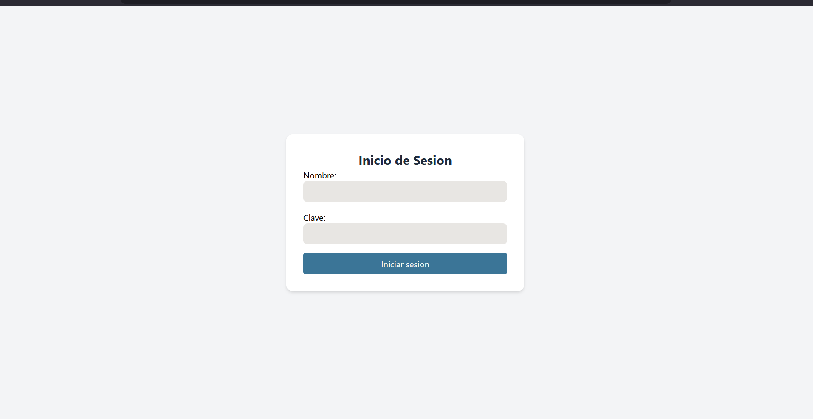
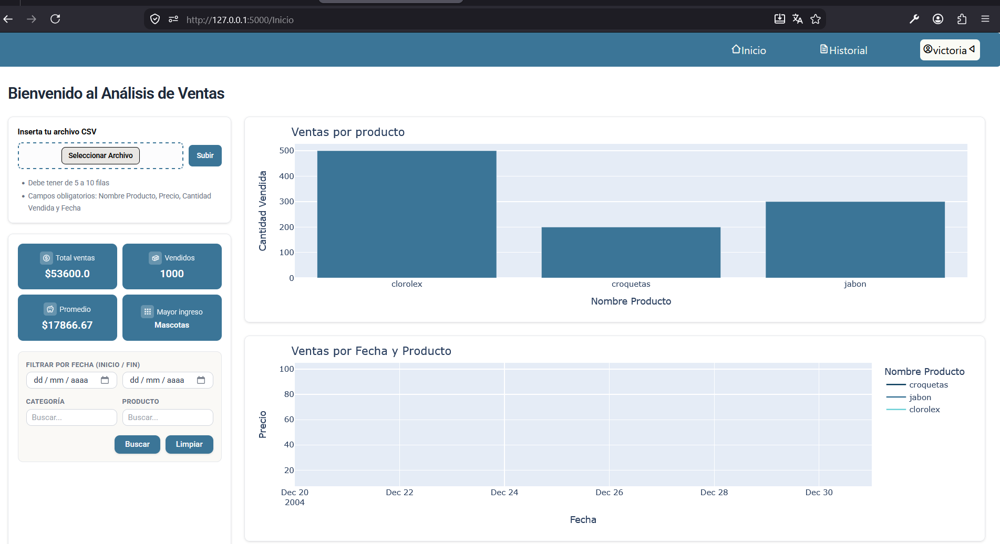
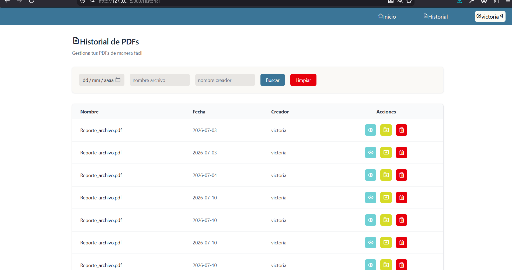
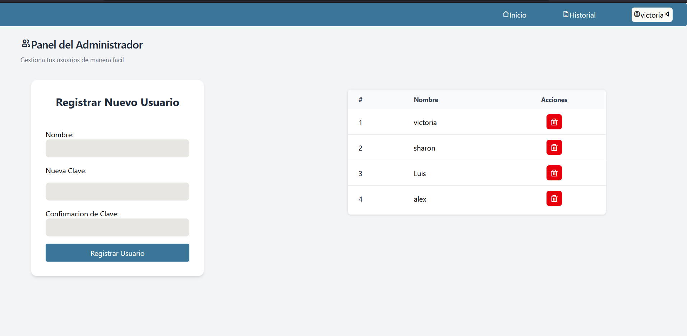
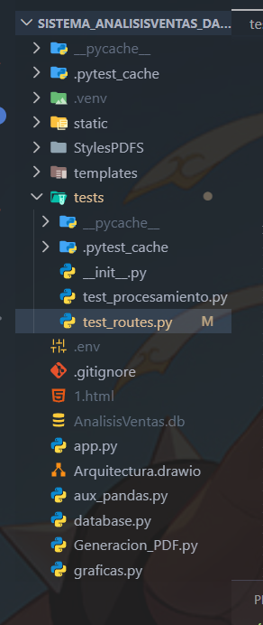
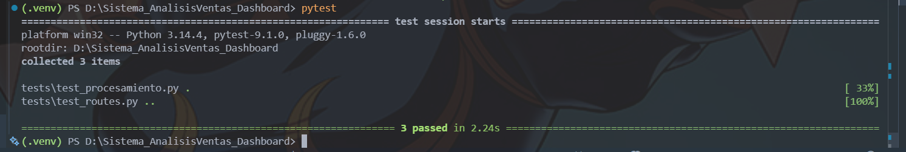

# 📊Sistema de Ventas-Dashboard

## 📋Descripcion

-Sistema que cuenta con un **validacion de sesion(login)**, un dashboard que muestra **ventas por producto, ventas por fecha y distribucion por categoria**.
-Podras tener conocimiento sobre **el total de ventas, productos vendidos, promedio de ventas, conocer el producto mas vendido y la categoria que cuenta con mas ingresos**.
-Ver un historial sobre tus peds generados, con funcionalidades como **descargar, ver y eliminar pdf**.
-Panel de Administrador para crear nuevos usuarios y eliminarlos.

Este proyecto fue pensado para agilizar procesos y la visualizacion de negocios, para ver desde otro punto tu negocio, si requieres guardar la informacion que viste en el dashboard se guardara en un pdf.

Proyecto en el que se sigue trabajando ya sea para mejorar el codigo o añadiendo nuevas funcionalidades.

## 🥳Se aceptan ideas

Ademas de que puedes descargar un pdf con dicha informacion.

---

## 🎞️Imagenes del producto

---

## 🐍Tests(Pruebas Unitarias)

